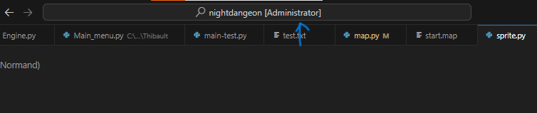
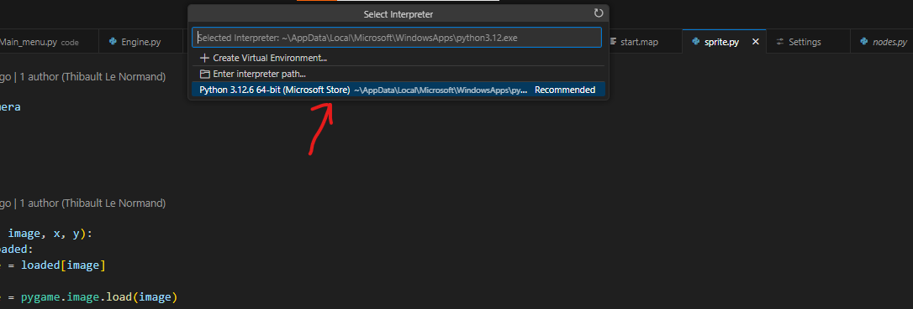

# Night Dungeon
## Table des matières

- [Night Dungeon](#Night-Dungeon)
	- [Table des matières](##Table-des-matières)
	- [Description](#Description)
  - [Lore](#Lore)
  - [Damages](#Damages)
    - [Mobs](#Mobs)
      - [Black Knight](#Black-Knight)
    - [Boss](#Boss)
      - [Carl](#Carl)
    - [Traps](#Traps)
       - [Spikes](#Spikes)
       - [Arrows Launcher](#Arrows-Launcher)
       - [Cracked Floor](#Cracked-Floor)
    - [Life Management](#Life-Management)
      - [Exemple life bar](#Exemple-life-bar)
    - [Void](#Void)
    - [The End](#The-End)
- [Installation](#Installation)
	-  [Install Python](#Install-Python)
 		- [Download Python](#Download-Python)
   		- [Start Installer](#Start-Installer)
	- [IDE Installation](#IDE-Installation)
 		- [Download Installer](#Download-Installer)
   		- [Start Installer](#Start-Installer)
   	- [Select Python Interpreter](#Select-Python-Interpreter)
   		- [Search](#Search)
   	 	- [Choose Interpreter](#Choose-Interpreter)
	- [Library necessary](#Library-necessary)
   		- [Pygame](#Pygame)
      		- [Pygame widgets](#Pygame-widgets)
  - [FAQ](#FAQ)
  - [Documentions Library Links](Documentions-Library-Links)
  - [Authors](#Authors)

## Description📃
Night Dungeon est un jeu d'aventure dont le but sera de trouver un objet mystique qui nous permettra de sortir du donjon. <br>
Cependant, ce ne sera pas si simple : des pièges, des monstres et des boss vous attendent pour vous empêcher de sortir du donjon.
>PS : Faites attention à l'endroit où vous mettez les pieds !


## Lore📜
Au cœur des terres maudites de Valmaris, se dresse une ancienne forteresse oubliée par le temps et les hommes : le Donjon de l’Éternelle Nuit.<br>
Autrefois bastion d’un puissant roi sorcier, le donjon est désormais prisonnier d'une malédiction qui plonge ses profondeurs dans une obscurité éternelle. <br>
Aucun être vivant n’a jamais échappé à ses labyrinthes ténébreux, et ceux qui s’y aventurent deviennent des âmes errantes, condamnées à errer dans l’ombre.<br>

Selon la légende, un artefact mystique nommé l’Œil de l’Aube repose dans les tréfonds du donjon. <br>
Cet artefact, d'une puissance incommensurable, serait la seule clé permettant de briser la malédiction et de retrouver la lumière du jour.<br>

## Damages💔
il y a deux types de dommages: 
- Type 1
- Type 2
Les dommages de type 1 sont des dommages infligé coeur par coeur et les dommages de type 2 donne la mort à votre personnage.

- Exemple de type 1: **[Spikes](#Spike)**
- Exemple de type 2: **[Cracked Floor](#Cracked-Floor)**

### Mobs🧟‍♀️
Les mobs sont des entités qui viennent à la rencontre du joueur pour luis infligé des dégats.
Les mobs apparaissent aléatoirement dans le donjon.

#### Black Knight🏇
Les Black Knight est un mob qui apparait aléatoirement dans le donjon et qui inflige des dégats de **[type 1](#type-1)** à l'aide de son épée.
Il se combat au corps-à-corps.
> PS : sa lame coupe beacoups fait attention

### Boss🦴
Les boss sont des entités trés forte qui apparaissent dans des salles bien définies.
#### Carl
Le boss nommé Carl est un ancien roi qui a été exilé de son royaume par les villageois et qui suite à beaucoup d'exploration fit la connaissence d'un certain donjon, une fois aller au donjon il se retrouva modit en trouvant un trésor.
La malédiction à le nom de "Keep-Chained", cette malédiction punis quiquonque qui touche au trésor sans l'avoir mérité à airer dans le donjon pour l'éternité.
### Traps🕳
Dans Night Dungeon il y a diférent types de pièges:
- [Spikes](#Spikes)
- [Arrows Launcher](#Arrows-Launcher)
- [Cracked Floor](#Cracked-Floor)

#### Spikes
Les **Spikes** sont des piques disposer sur le sol qui infligent des dégats au joueurs lorsqu'il marche dessus.<br>
La seule manière de ne pas prendre de dégats des spikes est de faire attention où on mets les pieds.

#### Arrows Launcher
Les **Arrows Launcher** sont des machines disposer sur les murs qui nous lance des flèches à un certain interval régulier, les flèches lancer par les Arrows Launcher peuvent être essquiver pour ne pas prendre de dégats.

#### Cracked Floor
Les **Cracked Floor** sont des zones générer alléatoirement qui lorseque nous marchons dessus le sol ce cassent et nous tombons dans le **[void](#void)**.<br> 
Se qui nous fait perdre la partie. La seul manière de ne pas mourir est de regarder où vous mettez les pieds.
### Damages Types Table
| Die             |Types                                                                |
| ----------------- | ------------------------------------------------------------------ |
| [Spikes](#Spikes) | 1 |
| [Arrows Launcher](#Arrows-Launcher) | 1 |
| [Cracked Floor](#Cracked-Floor) | 1 |
| [Black Knight](#Black-Knight) | 1 |
| [Carl](#Carl) | 1 |
| [Void](#Void) | 2 |


## Life Management ❤
La gestion de la vie est assez simples vous commencer simple lorque nous lancons une partie nous commencons avec 3 coeurs.<br>
Il y a différentes façons de récupérer ou de perdre de la vie.<br>
Nons pouvons regagner des vies en ouvrant des coffres ou en tuant des **[Boss](#Boss)** et nous pouvons perdre de la vie avec les **[Traps](#Traps)** ou le **[Void](#Void)**.<br>
Vous pouvez deppasser le nombre de 3 coeurs jusqu'à 5 coeurs après vous ne pourrez plus avoir de coeur suplémentaires mais vous pourrez les regagner si vous les perdez.
### Exemple life bar 


## Void💫
Le void est une la partie en dehors de la map si vous marcher sur un **[Cracked Floor](#Cracked-Floor)** vous y tombrer et découvrirez les profondeurs des ténèbres avant d'y perdre la vie.

## The End
La jeu se termine lorseque le joueur est mort ou que il a trouver l'objet mystique. 


------------

<br>
<br>
<br>

# Installation♾️

## Install Python
### Download Python
Allez sur le site de Python et téléchargez Python 3.12.

### Start Installer
Lancez l'installateur de Python et cliquez sur 'Continuer' jusqu'à la fin.

## IDE Installation
### Download Installer
Allez sur le site de [Visual Studio Code](https://code.visualstudio.com/) et télécharger.

### Start Installer
Lancez l'installeur et faite continuer.

## Select Python Interpreter
### Search
Dans la barre de recherche de Visual Studio Code, cherchez. 
```
>Python Select Interpreter
```


### Choose Interpreter
Sélectionnez un interpréteur s'il en existe déjà un, sinon cherchez Python sur votre PC après avoir sélectionné **Enter Interpreter Path**.


## 📚Library necessary
Ouvrez un nouveau terminal et executez les commande suivante.
### 🐍Pygame
```Python
pip install pygame
```
### 🐍Pygame widgets
```Python
pip install pygame_widgets
```


    
## FAQ❔

#### Quelle IDE faut-il utiliser?

Visual studio code

#### Je ne trouve pas pygame quand je lance le code?

Il faut bien choisir ton interpretter python dans ton IDE et voir si tu l'as bien installé

#### Quel fichier dois-je lancer?
Il faut lancer le Main_menu.py


## 🔗 Documentions Library Links
* [Pygame](https://www.pygame.org/docs/)
* [Pygame-widgets](https://pygamewidgets.readthedocs.io/en/stable/)
* [Visual Studio Code](https://code.visualstudio.com/)
* [Python](https://www.python.org/)


## Authors✍️

- [@mrtnGLSR](https://github.com/mrtnGLSR)
- [@Thibault343](https://github.com/Thibault343)

